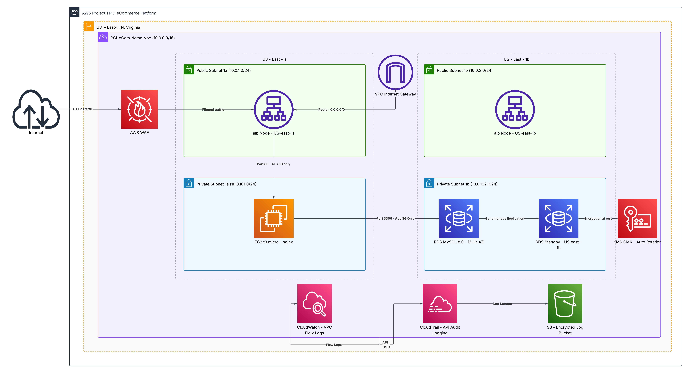

# Project 1: PCI-DSS Compliant E-Commerce Platform

## Business Context

A retail e-commerce company processing customer payment card transactions
required a cloud infrastructure that meets Payment Card Industry Data
Security Standard (PCI-DSS v4.0.1) requirements. The platform needed
network segmentation, encryption at rest, web application protection,
and a full audit logging trail to satisfy compliance obligations and
protect cardholder data.

---

## Architecture Overview



### Module 1 — Network Foundation (10-network)

* Multi-AZ VPC with public and private subnets across us-east-1a and us-east-1b
* Internet Gateway for public subnet outbound routing
* Private subnets with no internet route — enforces network segmentation
* Separate route tables for public and private tiers

### Module 2 — Edge & WAF (20-edge-waf)

* Internet-facing Application Load Balancer across public subnets
* AWS WAFv2 with AWSManagedRulesCommonRuleSet attached to ALB
* ALB security group restricting inbound to HTTP:80 only
* Target group configured for EC2 health checks

### Module 3 — Application Layer (25-app-ec2)

* EC2 t3.micro running nginx as application placeholder
* App security group allowing inbound only from ALB security group
* Instance registered to ALB target group — verified healthy

### Module 4 — Data Layer (30-data)

* RDS MySQL 8.0 in private subnets — not publicly accessible
* Multi-AZ enabled for high availability and automatic failover
* KMS customer-managed key with automatic rotation for encryption at rest
* RDS security group allowing MySQL port 3306 from app tier only

### Module 5 — Logging & Audit Evidence (40-logging-evidence)

* CloudTrail capturing all API calls with log file validation enabled
* VPC Flow Logs capturing all network traffic — 7 day retention in CloudWatch
* S3 logging bucket with AES-256 encryption, versioning, and public access blocked

---

## How to Deploy

### Prerequisites

* AWS account with IAM permissions for VPC, EC2, ALB, WAF, RDS, KMS, CloudTrail, S3, CloudWatch
* Terraform >= 1.0 installed
* AWS CLI configured with credentials (`aws configure`)
* Git installed

### Deploy Order

Deploy modules in this exact order — each module depends on the one before it:
```powershell
# 1 — Network Foundation
cd Terraform/10-network
terraform init && terraform plan
terraform apply

# 2 — Edge & WAF (requires 10-network outputs)
cd ../20-edge-waf
terraform init && terraform plan
terraform apply

# 3 — Application Layer (requires 20-edge-waf outputs)
cd ../25-app-ec2
terraform init && terraform plan
terraform apply

# 4 — Data Layer (requires 10-network outputs)
cd ../30-data
terraform init && terraform plan
terraform apply

# 5 — Logging & Audit (requires 10-network + 20-edge-waf outputs)
cd ../40-logging-evidence
terraform init && terraform plan
terraform apply
```

> After deploying each module run `terraform output` and update the
> `terraform.tfvars` in the next module with the output values before applying.

### How to Destroy (Cost Control)

Always destroy in reverse order to avoid dependency errors:
```powershell
cd Terraform/40-logging-evidence && terraform destroy
cd ../25-app-ec2 && terraform destroy
cd ../20-edge-waf && terraform destroy
cd ../10-network && terraform destroy
```

> Destroy RDS (30-data) immediately after validation — it costs ~$0.034/hr.
> Do not leave any module running overnight.

---

## PCI-DSS Principles Applied

* Network segmentation enforced — cardholder data environment isolated in private subnets with no direct internet route
* Least privilege security groups — each tier only accepts traffic from the tier directly above it
* Encryption at rest — RDS storage encrypted with KMS customer-managed key with automatic rotation
* Web application firewall — WAFv2 with OWASP managed rules protects against SQLi, XSS, and common web attacks
* Audit logging — CloudTrail captures every API action with tamper-evident log file validation
* Network traffic monitoring — VPC Flow Logs capture all traffic metadata for anomaly detection
* Log protection — S3 logging bucket encrypted, versioned, and fully blocked from public access
* No publicly accessible database — RDS deployed in private subnets, publicly_accessible = false

---

## Compliance Alignment

| PCI-DSS Requirement | Description | Implementation |
|---------------------|-------------|----------------|
| Req 1.2 | Restrict inbound and outbound traffic | Security groups enforce least privilege between all tiers |
| Req 1.3 | Prohibit direct public access to cardholder data environment | RDS and EC2 in private subnets with no internet route |
| Req 3.5 | Protect stored account data with strong cryptography | KMS CMK encryption on RDS with automatic key rotation |
| Req 6.4 | Protect web-facing applications from attacks | WAFv2 with AWSManagedRulesCommonRuleSet on ALB |
| Req 10.2 | Implement audit logs to detect anomalies | CloudTrail capturing all API calls across the account |
| Req 10.3 | Protect audit logs from destruction and modification | Log file validation enabled, S3 bucket versioned and encrypted |
| Req 10.4 | Secure audit logs from unauthorized access | S3 public access fully blocked, bucket policy restricts writes |
| Req 10.7 | Retain audit log history | CloudWatch log retention configured, S3 versioning enabled |
| Req 12.10 | Respond to suspected or confirmed security incidents | Multi-AZ RDS provides automatic failover for availability |

---

## Infrastructure as Code

All resources deployed via Terraform across 5 modules:

* `Terraform/10-network` — VPC, subnets, route tables, Internet Gateway
* `Terraform/20-edge-waf` — ALB, WAFv2, security groups, target group
* `Terraform/25-app-ec2` — EC2 instance, app security group, target group attachment
* `Terraform/30-data` — RDS MySQL, KMS key, DB subnet group, RDS security group
* `Terraform/40-logging-evidence` — CloudTrail, VPC Flow Logs, S3 logging bucket

---

## Tools & Technologies

* Terraform >= 1.0
* AWS (VPC, EC2, ALB, WAFv2, RDS MySQL, KMS, CloudTrail, VPC Flow Logs, CloudWatch, S3)
* MySQL 8.0
* nginx
* GitHub: AuthaHub

---

## References

* [PCI DSS v4.0.1 — Official Framework](https://docs-prv.pcisecuritystandards.org/PCI%20DSS/Standard/PCI-DSS-v4_0_1.pdf)
* [AWS WAF Developer Guide](https://docs.aws.amazon.com/waf/latest/developerguide/waf-chapter.html)
* [AWS RDS Encryption at Rest](https://docs.aws.amazon.com/AmazonRDS/latest/UserGuide/Overview.Encryption.html)
* [AWS CloudTrail User Guide](https://docs.aws.amazon.com/awscloudtrail/latest/userguide/cloudtrail-user-guide.html)
* [AWS VPC Flow Logs](https://docs.aws.amazon.com/vpc/latest/userguide/flow-logs.html)